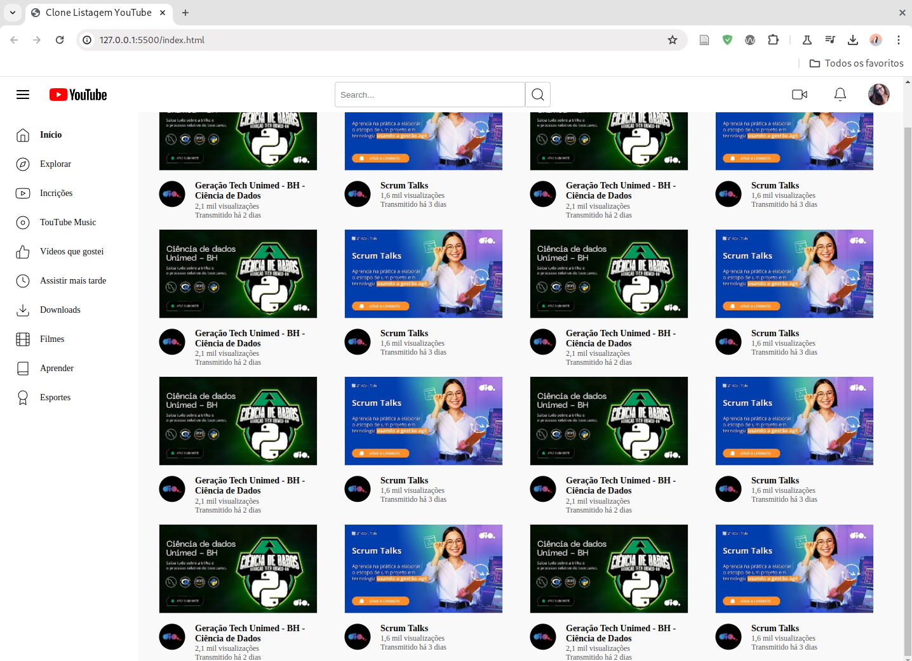

<h1>
    
    Formação CSS Web Developer
</h1>

# :computer: Desafio 03: Reproduzindo a Listagem do YouTube com Grid Layout no CSS

Neste Desafio você colocará a mão na massa e irá Construir a Página de Listagem de vídeos no YouTube com CSS colocando em prática todos os conceitos aprendidos, principalmente sobre Grid Layout.

Seja criativo(a) e dê a sua identidade para o Projeto. Lembre-se que para um(a) Profissional de Tecnologia é super importante ter um portfólio sólido e completo.
 
[Link do Figma](https://www.figma.com/file/KknwioExyqKD3D2eSVFrcW/Desafio-Grid---DIO?node-id=0%3A1) :
Aqui deixamos o link do Design no Figma apresentado pela Expert durante o Desafio para que você o tenha como referência:

# :bulb: Solução do desafio

Implementação nos arquivos <b>index.html</b> e <b>assets/css/style.css</b>. Deixei a barra de navegação e a barra lateral fixas ao rolar a página.

Print screen da página:

